# Plantify - Aplicación Web SPA de Tienda en Línea

Aplicación web tipo SPA desarrollada con Blazor WebAssembly bajo arquitectura cliente-servidor, que simula el funcionamiento de una tienda en línea. Permite la gestión de productos, carrito de compras y pedidos, integrando una API RESTful y base de datos en SQL Server.

---

## Objetivo

Desarrollar una aplicación web interactiva que implemente una arquitectura moderna basada en SPA, permitiendo gestionar productos, pedidos y usuarios, así como demostrar el consumo de servicios REST y manejo de estado en cliente.

---

## Tecnologías utilizadas

### Backend

* C#
* ASP.NET Core Web API
* Entity Framework
* SQL Server
* Stored Procedures (SQL Server)
* SqlConnection y SqlCommand

### Frontend

* Blazor WebAssembly (SPA)
* Razor Components
* Bootstrap

### Arquitectura

* Cliente - Servidor (Hosted Blazor WASM)

  * Client
  * Server
  * Shared

### Otros

* JSON (intercambio de datos)
* DTOs
* Inyección de dependencias
* Programación Orientada a Objetos (POO)

---

## Características técnicas destacadas

* Consumo de API RESTful desde cliente Blazor
* Manejo de estado del carrito mediante servicios inyectados (`Scoped`)
* Separación de responsabilidades mediante DTOs
* Integración con SQL Server mediante Entity Framework, SqlConnection y SqlCommand
* Uso de procedimientos almacenados para consultas específicas
* Arquitectura SPA con comunicación cliente-servidor

---

## Funcionalidades principales

### Cliente

* Login basada en base de datos
* Visualización de catálogo de productos
* Filtrado de productos por categorías
* Carrito de compras con persistencia en memoria (servicios inyectados)
* Creación de pedidos
* Consulta de historial de pedidos
* Consulta de pedido especifico
* Eliminación lógica de pedidos

### Administrador

* Autenticación basada en base de datos
* Ejecución de consultas mediante procedimientos almacenados
* Consumo de endpoints para obtención de información resumida
* Obtención de datos mediante respuestas en formato JSON
* Presentación de datos en tablas de Bootstrap

---

## Autenticación

* Sistema de login y registro basado en base de datos
* Manejo de roles:

  * Administrador
  * Cliente

---

## Arquitectura

El sistema está desarrollado bajo un enfoque cliente-servidor utilizando Blazor WebAssembly hospedado, estructurado en tres capas:

* **Client:** interfaz de usuario y lógica de presentación
* **Server:** API RESTful y lógica de negocio
* **Shared:** modelos compartidos (DTOs)

---

## Base de datos

* Motor: SQL Server
* Acceso mediante:

  * Entity Framework
  * SqlConnection y SqlCommand
    
* Uso de:

  * Stored Procedures
  * Triggers 
  * Scripts SQL para inicialización

---

## Instalación

1. Clonar el repositorio

```bash
git clone https://github.com/HarritoT1/Plantify.git
```

2. Abrir la solución en Visual Studio

3. Configurar la cadena de conexión en `appsettings.json`

4. Ejecutar los scripts SQL en SQL Server

5. Ejecutar el proyecto (Server)

El sistema utilizará HTTPS mediante certificado de desarrollo generado automáticamente por Visual Studio.

---

## Uso del sistema

### Flujo cliente

1. Inicio de sesión
2. Navegación por catálogo de productos
3. Filtrado por categorías
4. Agregar productos al carrito
5. Generar pedido
6. Consultar historial y detalle

### Flujo administrador

1. Inicio de sesión
2. Acceso a endpoints mediante parámetros
3. Consulta de información mediante procedimientos almacenados

---

## Estado del proyecto

Aplicación funcional desarrollada con fines académicos, orientada a demostrar el uso de Blazor WebAssembly, consumo de APIs REST y manejo de datos en SQL Server.

---

## Capturas del sistema

### Autenticación

<p align="center">
  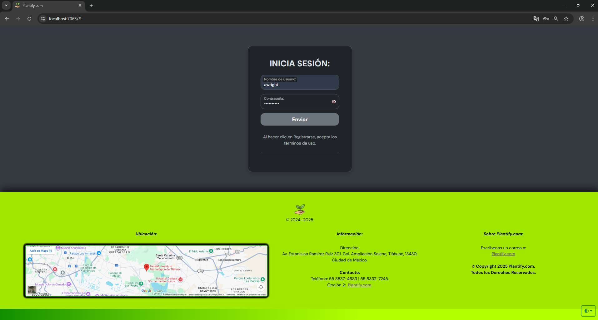
</p>

### Dashboard del cliente

<p align="center">
  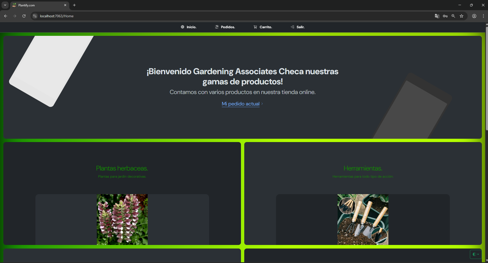
  &nbsp;&nbsp;&nbsp;
  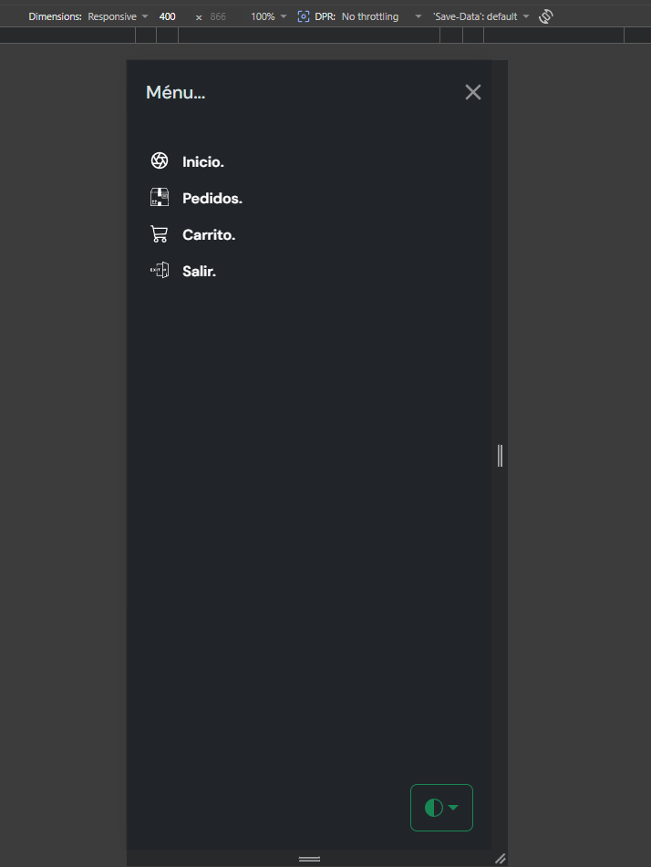
</p>

### Catálogo de productos

<p align="center">
  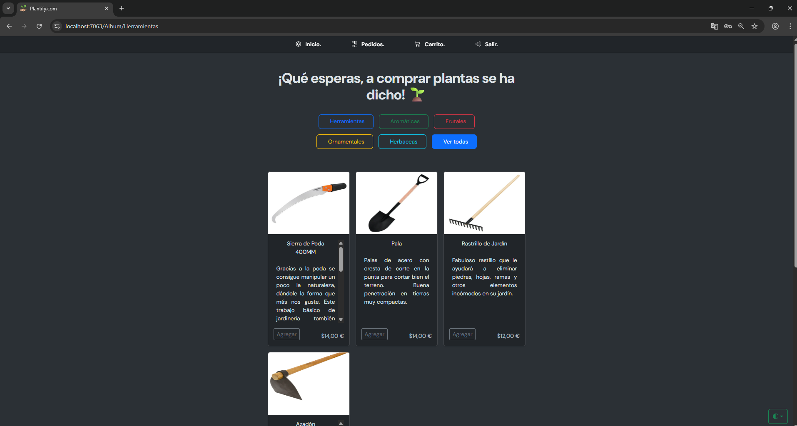
</p>

### Carrito de compras

<p align="center">
  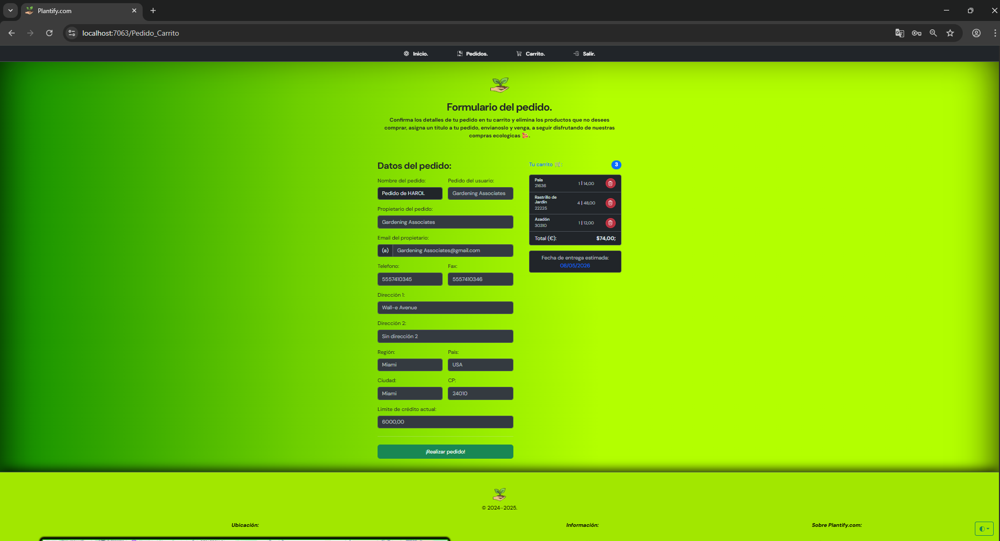
  &nbsp;&nbsp;&nbsp;
  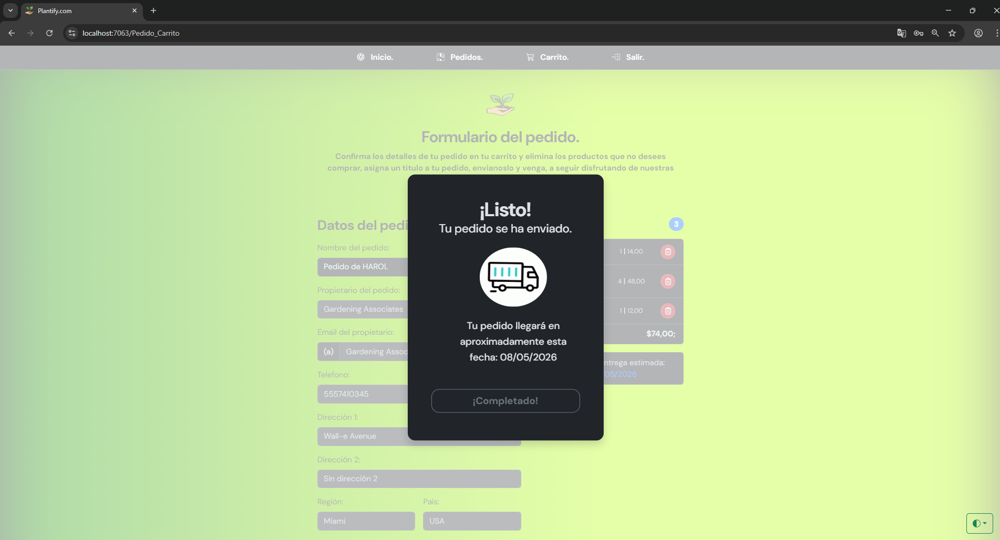
  &nbsp;&nbsp;&nbsp;
  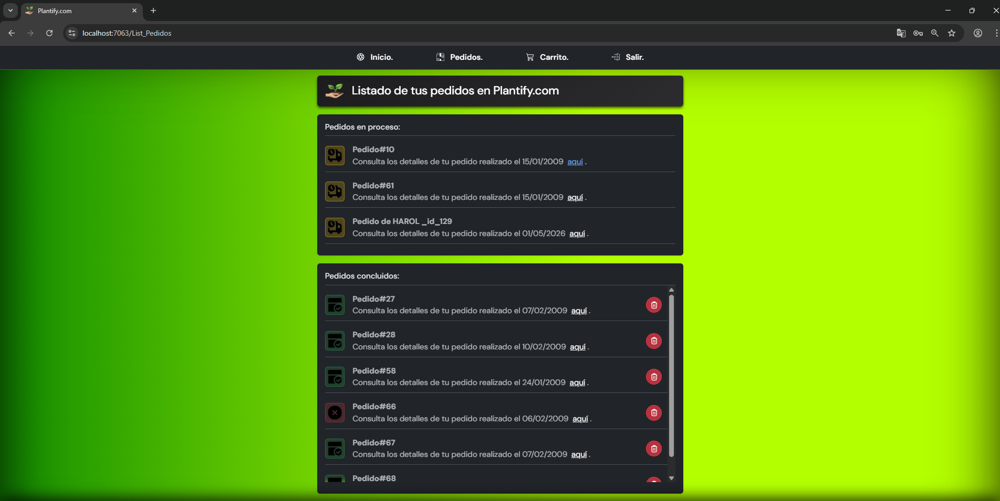
</p>

### Gestión de pedidos

<p align="center">
  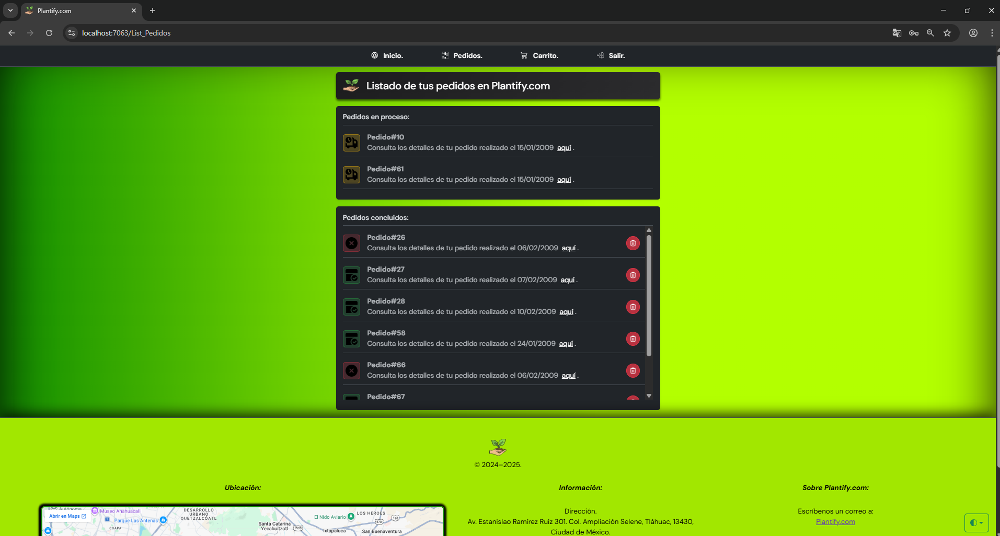
  &nbsp;&nbsp;&nbsp;
  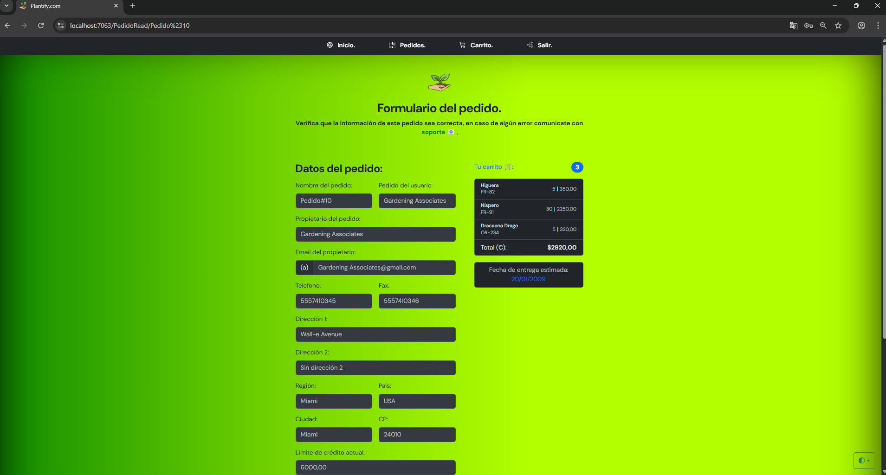
</p>

### Dashboard del administrador

<p align="center">
  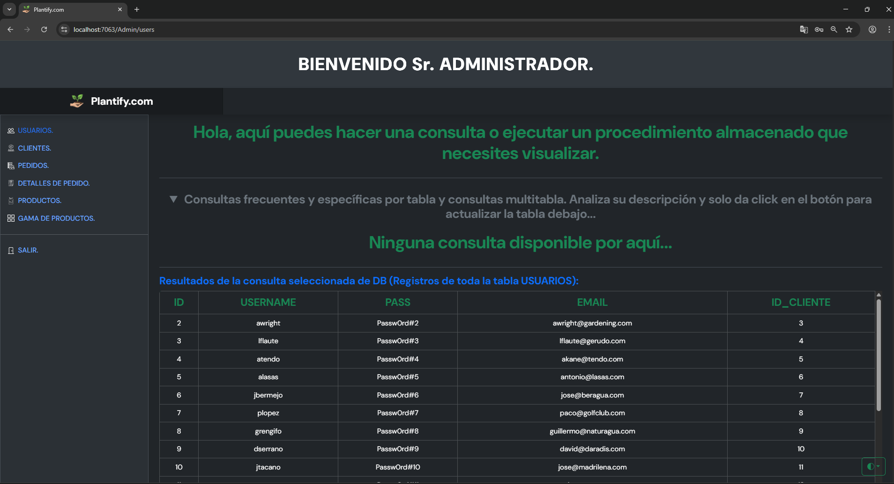
</p>

### Consultas del administrador

<p align="center">
  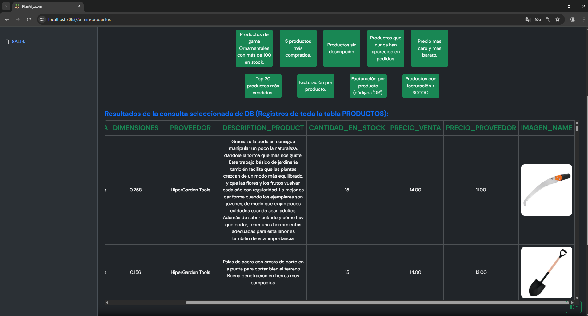
  &nbsp;&nbsp;&nbsp;
  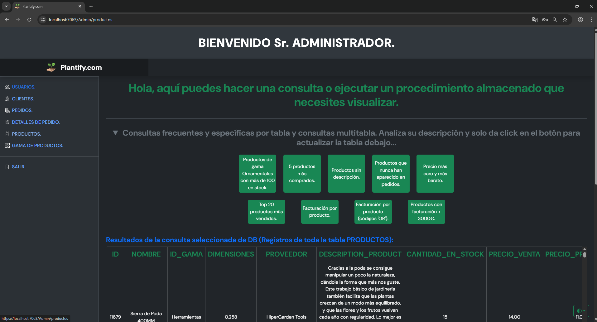
  &nbsp;&nbsp;&nbsp;
  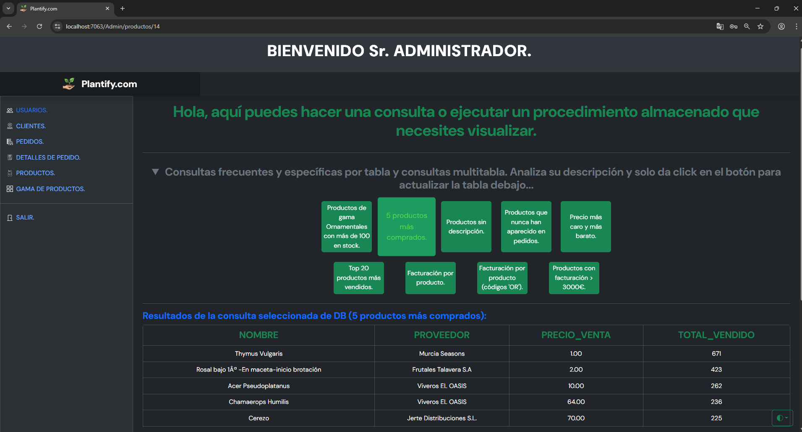
</p>

---

## Autor

Desarrollado por Ing. Harol Gael Cardenas Trejo Ingeniería en Sistemas Computacionales


